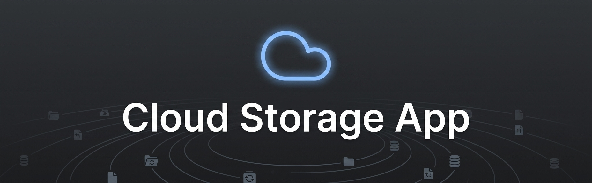
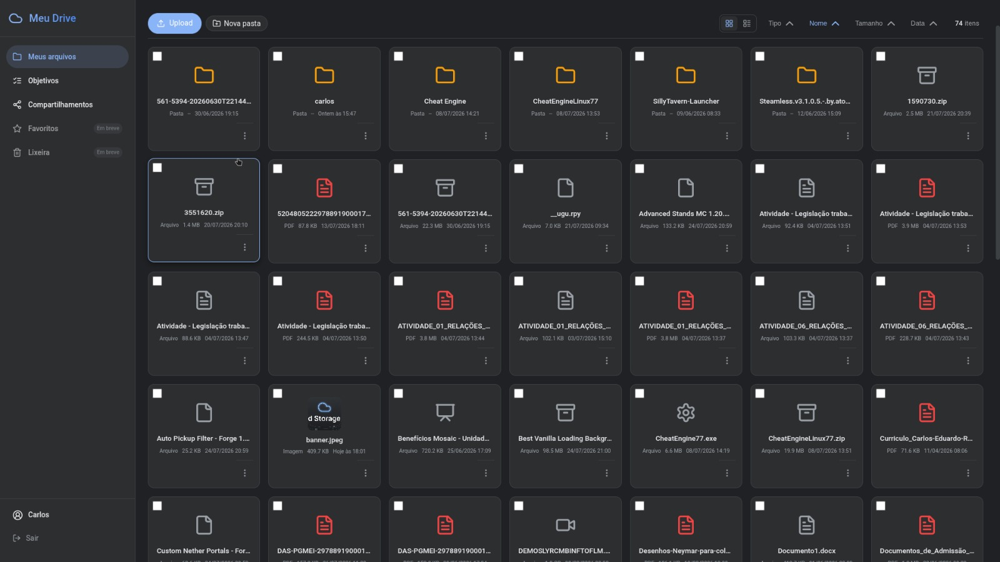
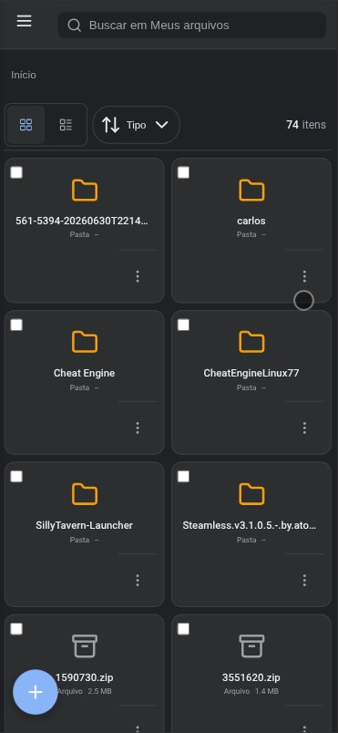
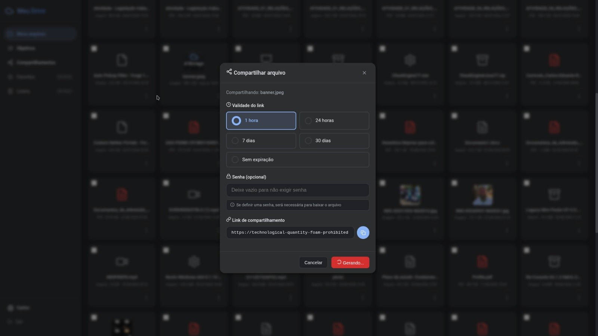

# Cloud Storage App

[](https://opensource.org/licenses/MIT)
[](https://python.org)
[](https://flask.palletsprojects.com/)
[](https://github.com/PointycarlosE/cloud-storage-app)

Uma solução de armazenamento em nuvem auto-hospedada com interface moderna e otimizada para mobile, inspirada no Google Drive. Construído com Python e Flask, oferece controle completo sobre seus dados sem depender de serviços de terceiros ou assinaturas.



## Visão Geral

**Cloud Storage App** transforma seu computador ou dispositivo móvel em um servidor de arquivos pessoal acessível via navegador web. Ele fornece uma experiência familiar de armazenamento em nuvem enquanto garante que você mantenha controle total e privacidade sobre seus dados.

### Principais Recursos

- **Sistema de Compartilhamento de Arquivos** - Gere links públicos com proteção por senha opcional e expiração
- **Autenticação Avançada** - Autenticação de dois fatores (2FA), recuperação de senha e notificações de login
- **Interface Otimizada para Mobile** - Interface redesenhada com ~40% mais espaço na tela para conteúdo
- **Multi-Plataforma** - Funciona em Windows, Linux, macOS e Android (Termux)
- **Interface Moderna** - Design responsivo com temas claro e escuro
- **Segurança em Primeiro Lugar** - Rate limiting, proteção CSRF, sessões seguras e log de auditoria
- **Deploy Fácil** - Modo de produção integrado com suporte a Cloudflare Tunnel

## Início Rápido

> **📚 IMPORTANTE:** Este é um guia resumido para instalação básica. Para evitar erros e frustrações, **leia a documentação completa** antes de começar, especialmente se você nunca usou Python ou terminal antes. A documentação explica cada passo em detalhes e cobre diferentes sistemas operacionais.
>
> - **Primeira vez com Python?** Leia o [Guia de Instalação Completo](docs/INSTALLATION.md)
> - **Dúvidas ou problemas?** Consulte [Solução de Problemas](docs/TROUBLESHOOTING.md) ou [abra uma issue](https://github.com/PointycarlosE/cloud-storage-app/issues)

### Pré-requisitos

- Python 3.10 ou superior ([Download aqui](https://www.python.org/downloads/))
- Git ([Download aqui](https://git-scm.com/downloads))

### Instalação

**Onde executar os comandos:**
- **Windows:** Prompt de Comando (Win+R, digite `cmd`) ou PowerShell
- **macOS:** Terminal (Cmd+Espaço, digite "Terminal")
- **Linux:** Terminal (geralmente Ctrl+Alt+T)

```bash
# Clone o repositório
git clone https://github.com/PointycarlosE/cloud-storage-app.git
cd cloud-storage-app

# Crie e ative o ambiente virtual
# (Ambiente virtual = instalação isolada do Python para este projeto)
python -m venv venv

# Ative o ambiente virtual:
# Linux/macOS:
source venv/bin/activate
# Windows (CMD):
venv\Scripts\activate.bat
# Windows (PowerShell):
venv\Scripts\Activate.ps1

# ✓ Você deve ver (venv) antes do cursor no terminal

# Instale as dependências
pip install -r requirements.txt

# Baixe a biblioteca de ícones
# Linux/macOS:
curl -o frontend/static/js/lucide.min.js https://unpkg.com/lucide@0.383.0/dist/umd/lucide.min.js
# Windows (PowerShell):
# Invoke-WebRequest -Uri 'https://unpkg.com/lucide@0.383.0/dist/umd/lucide.min.js' -OutFile 'frontend/static/js/lucide.min.js'
```

> **💡 Dica:** Se `python` não funcionar, tente `python3` (Linux/macOS) ou `py` (Windows)

### Primeira Execução

```bash
# Certifique-se de que o ambiente virtual está ativado (deve ver "(venv)" no terminal)
# Inicie o servidor de desenvolvimento
python run.py
```

**✓ O que você deve ver:**
```
🆕 Primeira execução detectada!
   Acesse http://localhost:5000/setup para configurar
 * Running on http://0.0.0.0:5000
```

Acesse `http://localhost:5000/setup` no seu navegador para completar a configuração inicial:
- Configure seu nome de usuário e senha de administrador
- Configure as configurações de email (opcional mas recomendado)
- Escolha sua pasta de armazenamento

Após a configuração, faça login e comece a gerenciar seus arquivos!

> **⚠️ Nota:** Mantenha o terminal aberto enquanto usa o aplicativo. Para parar o servidor, pressione Ctrl+C.

## Documentação

- **[Guia de Instalação](docs/INSTALLATION.md)** - Instruções detalhadas de instalação para todas as plataformas
- **[Configuração](docs/CONFIGURATION.md)** - Variáveis de ambiente e configurações avançadas
- **[Recursos](docs/FEATURES.md)** - Documentação completa de funcionalidades
- **[Deploy](docs/DEPLOYMENT.md)** - Deploy em produção com Cloudflare Tunnel
- **[Solução de Problemas](docs/TROUBLESHOOTING.md)** - Problemas comuns e soluções
- **[Documentação da API](docs/API.md)** - Referência da API REST

## Suporte de Plataformas

| Plataforma | Status | Documentação |
|----------|--------|---------------|
| Linux | Totalmente Suportado | [Guia de Instalação](docs/INSTALLATION.md#linux) |
| Windows | Totalmente Suportado | [Guia de Instalação](docs/INSTALLATION.md#windows) |
| macOS | Totalmente Suportado | [Guia de Instalação](docs/INSTALLATION.md#macos) |
| Android (Termux) | Totalmente Suportado | [Guia de Instalação](docs/INSTALLATION.md#android-termux) |

## Destaques dos Recursos

### Gerenciamento de Arquivos
- Upload de múltiplos arquivos com suporte a arrastar e soltar
- Rastreamento de progresso de upload em tempo real
- Download de arquivos individualmente ou como arquivos ZIP
- Criar e gerenciar pastas
- Seleção múltipla (Ctrl+Clique, Ctrl+A)
- Busca rápida com filtragem ao vivo
- Ordenação inteligente (tipo, nome, tamanho, data)

### Compartilhamento de Arquivos
- Gerar links públicos de compartilhamento
- Proteção por senha opcional
- Expiração configurável (1h, 24h, 7d, 30d, ou nunca)
- Rastrear estatísticas de download
- Revogar links a qualquer momento
- Pré-visualização de imagens para arquivos compartilhados

### Segurança
- Hash seguro de senhas (pbkdf2:sha256 com 600.000 iterações)
- Autenticação de dois fatores (2FA) com TOTP
- Recuperação de senha via email
- Notificações de login
- Gerenciamento de sessão com cookies seguros
- Rate limiting em endpoints sensíveis
- Log de auditoria de todas as ações do usuário
- Proteção CSRF
- Headers de segurança (CSP, HSTS, X-Frame-Options)

### Experiência do Usuário
- Design responsivo para todos os tamanhos de tela
- Suporte a temas claro e escuro
- Visualizador lightbox de imagens
- Player de áudio com controles
- Visualizador de PDF
- Atalhos de teclado
- Notificações toast
- Interface otimizada para mobile com princípios do Material Design

## Stack de Tecnologia

- **Backend:** Python 3.10+, Flask 2.3+
- **Frontend:** JavaScript Vanilla, HTML5, CSS3
- **Banco de Dados:** SQLite
- **Ícones:** Lucide Icons (SVG)
- **Servidor de Produção:** Gunicorn
- **Túnel:** Cloudflare Tunnel
- **Email:** Flask-Mail com suporte SMTP

## Capturas de Tela

### Interface Desktop


### Interface Mobile


### Compartilhamento de Arquivos


## Contribuindo

Contribuições são bem-vindas! Por favor, siga estas diretrizes:

1. Faça um fork do repositório
2. Crie um branch de feature (`git checkout -b feature/minha-feature`)
3. Faça suas alterações com mensagens de commit claras
4. Adicione testes para novas funcionalidades
5. Garanta que todos os testes passem
6. Envie um pull request

Veja [CONTRIBUTING.md](CONTRIBUTING.md) para diretrizes detalhadas.

## Roadmap

### Implementado
- [x] Sistema de autenticação avançado (2FA, recuperação de senha, notificações por email)
- [x] Compartilhamento de arquivos com links públicos
- [x] Interface otimizada para mobile
- [x] Upload com arrastar e soltar
- [x] Operações em lote
- [x] Temas claro/escuro
- [x] Log de auditoria
- [x] Scripts de deploy em produção

### Planejado
- [ ] Interface de visualização de log de auditoria
- [ ] Player de vídeo
- [ ] Lixeira para arquivos deletados
- [ ] Sistema de favoritos
- [ ] Suporte multi-usuário com permissões
- [ ] Filtros de busca avançada
- [ ] Pré-visualização de documentos (.docx, .xlsx, .pptx)
- [ ] Editor de texto online

Veja [ROADMAP.md](docs/ROADMAP.md) para o roadmap completo.

## Licença

Este projeto está licenciado sob a Licença MIT - veja o arquivo [LICENSE](LICENSE) para detalhes.

## Autor

**Carlos** - [GitHub](https://github.com/PointycarlosE)

## Agradecimentos

Agradecimentos especiais aos criadores de:
- [Flask](https://flask.palletsprojects.com/) - O framework web
- [Lucide Icons](https://lucide.dev/) - A biblioteca de ícones
- [Cloudflare Tunnel](https://developers.cloudflare.com/cloudflare-one/connections/connect-apps/) - Túnel HTTPS gratuito
- [Google Drive](https://drive.google.com/) - Inspiração de design

## Suporte

Encontrou um problema ou tem dúvidas? Estamos aqui para ajudar!

- **📖 Documentação Completa:** Leia os [guias detalhados](docs/) antes de reportar problemas
- **🐛 Bugs e Erros:** [Abra uma issue](https://github.com/PointycarlosE/cloud-storage-app/issues) com detalhes do problema
- **❓ Dúvidas e Perguntas:** Use [GitHub Discussions](https://github.com/PointycarlosE/cloud-storage-app/discussions)
- **💡 Sugestões de Recursos:** Compartilhe suas ideias nas [Discussions](https://github.com/PointycarlosE/cloud-storage-app/discussions)
- **🔒 Problemas de Segurança:** Envie um email privado ao invés de abrir issue pública

**Ao reportar problemas, inclua:**
- Sistema operacional (Windows/Linux/macOS/Termux)
- Versão do Python (`python --version`)
- Mensagens de erro completas
- Passos para reproduzir o problema

## Histórico de Estrelas

Se este projeto te ajudou, por favor considere dar uma estrela!

---

**Feito com cuidado por Carlos**
